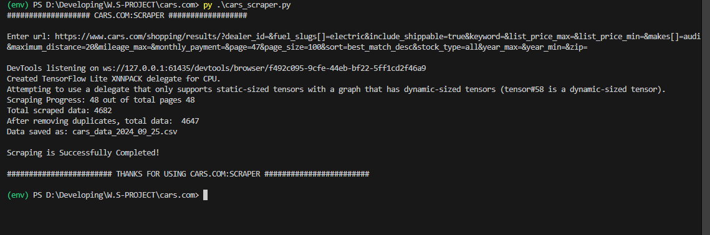
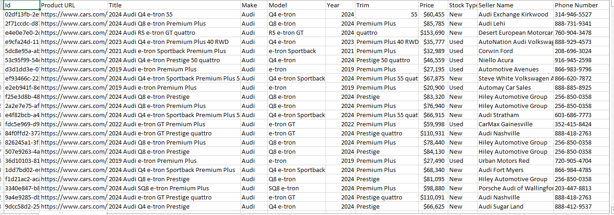

# Cars.com Scraper

## Overview

This Python-based web scraper is designed to extract car listings from [cars.com](https://www.cars.com). It automates browser interaction using `Selenium` to handle dynamic content and utilizes `BeautifulSoup` for parsing the HTML to extract relevant car details. The data collected includes car make, model, year, price, Seller name, and contact information, which is then saved in a CSV file for further analysis.

The script efficiently handles pagination, collects data from multiple pages, and removes duplicate entries before saving the data.

---

## Features

- **Web Automation**: Automates navigation and page interactions with `Selenium`.
- **Data Parsing**: Uses `BeautifulSoup` to extract specific car details from HTML.
- **Pagination Handling**: Automatically scrapes data across multiple pages of search results.
- **Duplicate Removal**: Ensures unique records based on car listing ID.
- **CSV Export**: Saves the scraped data in a CSV file.
- **Progress Display**: Updates progress in the terminal, showing the number of pages scraped.

---

## Libraries Used

- **Selenium**: Automates browser interactions to navigate through pages and handle dynamic content.
- **BeautifulSoup (bs4)**: Parses the HTML content of each page to extract relevant car details.
- **Pandas**: Organizes the scraped data into a structured DataFrame and saves it as a CSV file.
- **OS, sys, time**: Provides basic system interaction, such as file operations, output flushing, and time delays.

---

## How It Works

1. **Input URL**: The user inputs a search URL from `cars.com`.
2. **URL Validation**: The script checks and formats the URL to ensure that it handles pagination and `page_size` parameters correctly.
3. **Browser Automation**: Using `Selenium`, the script opens a Chrome browser and navigates through the search result pages.
4. **Data Scraping**: The car details such as make, model, year, trim, price, and Seller information are extracted using `BeautifulSoup`.
5. **Pagination**: The scraper navigates through all pages until the last one is reached, collecting data from each.
6. **Data Cleaning and Saving**: After scraping, duplicates are removed based on unique car listing IDs, and the cleaned data is saved to a CSV file.

---

## Data Collected

The script collects the following details for each car listing:

- **Listing ID**: Unique identifier for the car.
- **Product URL**: Link to the car listing on `cars.com`.
- **Title**: Car listing title.
- **Make**: Car manufacturer (e.g., Toyota, Honda).
- **Model**: Car model (e.g., Camry, Civic).
- **Year**: The manufacturing year of the car.
- **Trim**: Specific details of the car model's trim.
- **Price**: Listed price of the car.
- **Stock Type**: Indicates whether the car is new or used.
- **Seller Name**: Name of the car Seller.
- **Phone Number**: Contact phone number for the Seller.

---

## Script Breakdown

### 1. **Utility Functions**

- `update_message(message)`: Displays a progress message in the terminal, updating on the same line.
  
- `get_valid_inputurl(url)`: Ensuring the url is correctly structured for pagination scraping.

### 2. **Main Functions**

- `get_total_pages(input_url, driver)`: Loads the webpage and extracts the total number of pages from the pagination links. This is important for navigating through multiple pages of search results.
  
- `data_collect(url)`: The core function responsible for:
  - Validating the URL.
  - Navigating through each page of results.
  - Scraping the car listings from the page.
  - Collecting and storing relevant car details.
  - Removing duplicates and saving the final dataset to a CSV file.

### 3. **Scraping Logic**

- The browser is automated using `Selenium` to load each page.
- `BeautifulSoup` is used to parse the page's HTML and extract specific car details from "spark-button" tags and their parent elements.
- The extracted details are saved into a list of dictionaries, which is later converted into a `pandas` DataFrame for further processing.

---

## Installation and Setup

### 1. **Install Dependencies**

Before running the scraper, install the required Python libraries using `pip`:

```bash
pip install selenium beautifulsoup4 pandas
```

### 2. **Run the Script**

Once dependencies are installed and `ChromeDriver` is set up, run the script:

```bash
python cars_scraper.py
```

You will be prompted to enter the URL for a car search from `cars.com`.

Example:

```bash
Enter url: https://www.cars.com/shopping/results/?dealer_id=&fuel_slugs[]=electric&include_shippable=true&keyword=&list_price_max=&list_price_min=&makes[]=audi&maximum_distance=20&mileage_max=&monthly_payment=&page_size=20&sort=best_match_desc&stock_type=all&year_max=&year_min=&zip=
```

### 3. **Progress Display**
Example:




### 4. **Output**

The script will scrape the data and generate a CSV file with a name in the format `cars_data_<YYYY_MM_DD>.csv`, containing the following columns:

- ID
- Product URL
- Title
- Make
- Model
- Year
- Trim
- Price
- Stock Type
- Seller Name
- Phone Number

The total number of listings will be displayed, along with the count after removing duplicates.

---

## Example Output

Sample data collected in the CSV file:



---

## Enhancements

1. **Error Handling**: The script includes error handling to avoid crashes during the scraping process if an element is missing or a page fails to load.
  
2. **Duplicate Handling**: Ensures that duplicate car listings are removed based on the unique listing ID, providing a clean dataset.
  
3. **Scalability**: Designed to handle large amounts of data, especially for multi-page search results.

---

## Contact Me

For any inquiries or service requests, please reach out to me via LinkedIn or visit my portfolio website:

- **Portfolio:** [mominur.dev](https://mominur.dev)
- **GitHub:** [github.com/mominurr](https://github.com/mominurr)
- **LinkedIn:** [linkedin.com/in/mominur--rahman](https://www.linkedin.com/in/mominur--rahman/)
- **Email:** mominurr518@gmail.com

I look forward to connecting with you!

